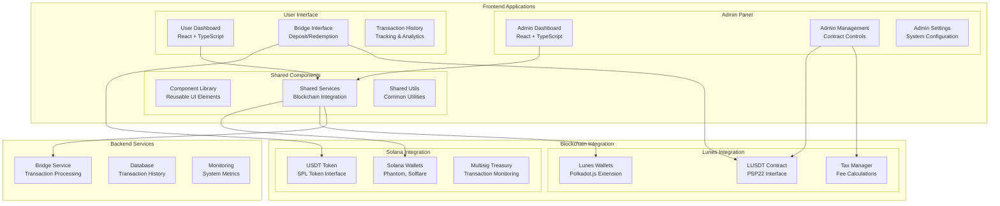
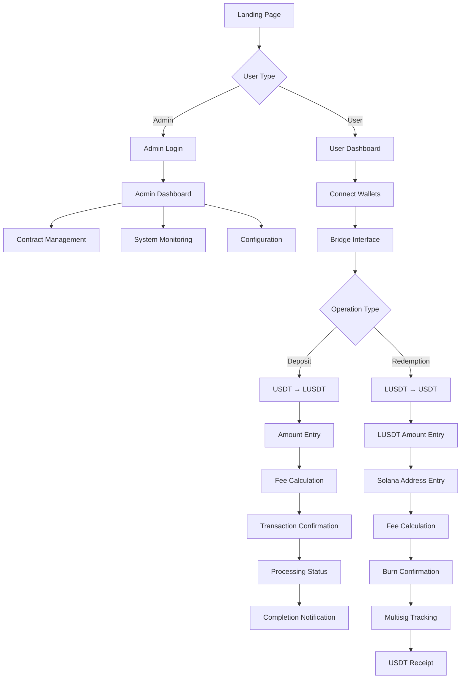

# Design Document - LUSDT Frontend Completion

## Overview

This design document outlines the architecture and implementation strategy for completing the LUSDT frontend ecosystem. The solution includes finalizing the administrative panel and creating a comprehensive user interface for cross-chain USDT/LUSDT operations.

The design follows a modular approach with shared components, unified state management, and responsive design principles to provide seamless experiences across both administrative and user-facing interfaces.

## Architecture

### High-Level Architecture



### Application Structure

```
lusdt-frontend/
├── packages/
│   ├── admin-panel/          # Existing admin panel
│   ├── user-interface/       # New user-facing app
│   ├── shared-components/    # Reusable UI components
│   ├── blockchain-services/  # Blockchain integration
│   └── shared-utils/         # Common utilities
├── apps/
│   ├── admin/               # Admin panel build
│   └── user/                # User interface build
└── docs/                    # Documentation
```

## Components and Interfaces

### Shared Component Library

```typescript
// Core UI Components
interface ComponentLibrary {
  // Layout Components
  Layout: React.FC<LayoutProps>;
  Header: React.FC<HeaderProps>;
  Sidebar: React.FC<SidebarProps>;
  Footer: React.FC<FooterProps>;
  
  // Form Components
  Input: React.FC<InputProps>;
  Button: React.FC<ButtonProps>;
  Select: React.FC<SelectProps>;
  AmountInput: React.FC<AmountInputProps>;
  AddressInput: React.FC<AddressInputProps>;
  
  // Display Components
  Card: React.FC<CardProps>;
  Table: React.FC<TableProps>;
  Chart: React.FC<ChartProps>;
  StatusBadge: React.FC<StatusBadgeProps>;
  TransactionItem: React.FC<TransactionItemProps>;
  
  // Wallet Components
  WalletConnector: React.FC<WalletConnectorProps>;
  WalletDisplay: React.FC<WalletDisplayProps>;
  NetworkSelector: React.FC<NetworkSelectorProps>;
  
  // Bridge Components
  BridgeForm: React.FC<BridgeFormProps>;
  TransactionTracker: React.FC<TransactionTrackerProps>;
  FeeCalculator: React.FC<FeeCalculatorProps>;
}
```

### Blockchain Services Architecture

```typescript
interface BlockchainServices {
  // Solana Integration
  solana: {
    walletService: SolanaWalletService;
    tokenService: SolanaTokenService;
    treasuryService: TreasuryService;
  };
  
  // Lunes Integration
  lunes: {
    walletService: LunesWalletService;
    contractService: LunesContractService;
    taxService: TaxManagerService;
  };
  
  // Bridge Integration
  bridge: {
    depositService: DepositService;
    redemptionService: RedemptionService;
    trackingService: TransactionTrackingService;
  };
}

class SolanaWalletService {
  async connect(walletType: SolanaWalletType): Promise<SolanaWallet>;
  async disconnect(): Promise<void>;
  async getBalance(tokenMint: string): Promise<number>;
  async sendTransaction(transaction: Transaction): Promise<string>;
  async signMessage(message: string): Promise<string>;
}

class LunesWalletService {
  async connect(): Promise<LunesWallet>;
  async disconnect(): Promise<void>;
  async getBalance(contractAddress: string): Promise<number>;
  async executeContract(call: ContractCall): Promise<string>;
  async signTransaction(transaction: LunesTransaction): Promise<string>;
}
```

### State Management Architecture

```typescript
// Global State Store
interface AppState {
  // User State
  user: {
    solanaWallet: SolanaWallet | null;
    lunesWallet: LunesWallet | null;
    permissions: UserPermissions;
    preferences: UserPreferences;
  };
  
  // Bridge State
  bridge: {
    deposits: DepositTransaction[];
    redemptions: RedemptionTransaction[];
    pendingTransactions: PendingTransaction[];
    transactionHistory: TransactionHistory[];
  };
  
  // System State
  system: {
    networkStatus: NetworkStatus;
    bridgeStatus: BridgeStatus;
    feeRates: FeeRates;
    systemMetrics: SystemMetrics;
  };
  
  // UI State
  ui: {
    loading: LoadingState;
    errors: ErrorState;
    notifications: Notification[];
    modals: ModalState;
  };
}

// Store Actions
interface StoreActions {
  // Wallet Actions
  connectSolanaWallet: (walletType: SolanaWalletType) => Promise<void>;
  connectLunesWallet: () => Promise<void>;
  disconnectWallets: () => Promise<void>;
  
  // Bridge Actions
  initiateDeposit: (params: DepositParams) => Promise<string>;
  initiateRedemption: (params: RedemptionParams) => Promise<string>;
  trackTransaction: (txId: string) => Promise<void>;
  
  // System Actions
  updateNetworkStatus: () => Promise<void>;
  updateFeeRates: () => Promise<void>;
  fetchTransactionHistory: () => Promise<void>;
}
```

## Data Models

### Transaction Models

```typescript
interface DepositTransaction {
  id: string;
  solanaSignature: string;
  lunesTransactionHash?: string;
  amount: number;
  fee: number;
  status: TransactionStatus;
  timestamps: {
    initiated: Date;
    detected?: Date;
    processed?: Date;
    completed?: Date;
  };
  addresses: {
    solanaFrom: string;
    lunesTo: string;
  };
  metadata: {
    memo: string;
    confirmations: number;
    retryCount: number;
  };
}

interface RedemptionTransaction {
  id: string;
  lunesTransactionHash: string;
  solanaSignature?: string;
  amount: number;
  fee: number;
  status: TransactionStatus;
  timestamps: {
    initiated: Date;
    burned?: Date;
    proposed?: Date;
    approved?: Date;
    completed?: Date;
  };
  addresses: {
    lunesFrom: string;
    solanaTo: string;
  };
  multisig: {
    proposalId?: string;
    approvals: number;
    required: number;
  };
}

enum TransactionStatus {
  PENDING = 'pending',
  DETECTED = 'detected',
  PROCESSING = 'processing',
  CONFIRMING = 'confirming',
  COMPLETED = 'completed',
  FAILED = 'failed',
  CANCELLED = 'cancelled'
}
```

### User Interface Models

```typescript
interface BridgeFormData {
  direction: 'deposit' | 'redemption';
  amount: string;
  destinationAddress: string;
  feeType: 'lunes' | 'lusdt' | 'usdt';
  slippage: number;
  priority: 'normal' | 'fast';
}

interface FeeCalculation {
  baseAmount: number;
  feeAmount: number;
  feePercentage: number;
  feeCap: number;
  distribution: {
    dev: number;
    dao: number;
    backing?: number;
    rewards?: number;
    burn?: number;
    liquidity?: number;
  };
  totalReceived: number;
}

interface NetworkStatus {
  solana: {
    connected: boolean;
    blockHeight: number;
    tps: number;
    avgFee: number;
  };
  lunes: {
    connected: boolean;
    blockHeight: number;
    finalizedHeight: number;
    avgBlockTime: number;
  };
  bridge: {
    operational: boolean;
    paused: boolean;
    lastProcessed: Date;
    queueLength: number;
  };
}
```

## Error Handling

### Error Classification and Recovery

```typescript
enum ErrorType {
  WALLET_CONNECTION = 'wallet_connection',
  INSUFFICIENT_BALANCE = 'insufficient_balance',
  NETWORK_ERROR = 'network_error',
  TRANSACTION_FAILED = 'transaction_failed',
  VALIDATION_ERROR = 'validation_error',
  BRIDGE_ERROR = 'bridge_error',
  SYSTEM_ERROR = 'system_error'
}

interface ErrorHandler {
  handleError(error: AppError): ErrorResponse;
  recoverFromError(error: AppError): Promise<boolean>;
  showUserFriendlyMessage(error: AppError): string;
}

class ErrorRecoveryService {
  async recoverFromWalletError(error: WalletError): Promise<boolean> {
    switch (error.code) {
      case 'USER_REJECTED':
        return this.promptUserRetry();
      case 'INSUFFICIENT_FUNDS':
        return this.suggestFundingOptions();
      case 'NETWORK_ERROR':
        return this.retryWithBackoff();
      default:
        return false;
    }
  }
  
  async recoverFromTransactionError(error: TransactionError): Promise<boolean> {
    if (error.retryable) {
      return this.retryTransaction(error.transactionId);
    }
    return this.offerAlternativeOptions(error);
  }
}
```

### User Feedback System

```typescript
interface NotificationSystem {
  showSuccess(message: string, duration?: number): void;
  showError(message: string, actions?: NotificationAction[]): void;
  showWarning(message: string, dismissible?: boolean): void;
  showInfo(message: string, persistent?: boolean): void;
  showProgress(message: string, progress: number): void;
}

interface NotificationAction {
  label: string;
  action: () => void;
  style: 'primary' | 'secondary' | 'danger';
}
```

## Testing Strategy

### Component Testing

```typescript
// Component Test Structure
describe('BridgeForm Component', () => {
  test('validates input amounts correctly', async () => {
    const { getByTestId, getByText } = render(<BridgeForm />);
    
    const amountInput = getByTestId('amount-input');
    fireEvent.change(amountInput, { target: { value: '1000' } });
    
    await waitFor(() => {
      expect(getByText('Fee: 5 LUNES')).toBeInTheDocument();
    });
  });
  
  test('handles wallet connection errors gracefully', async () => {
    const mockWalletService = {
      connect: jest.fn().mockRejectedValue(new Error('User rejected'))
    };
    
    const { getByTestId } = render(
      <BridgeForm walletService={mockWalletService} />
    );
    
    fireEvent.click(getByTestId('connect-wallet-button'));
    
    await waitFor(() => {
      expect(getByTestId('error-message')).toHaveTextContent(
        'Please approve the wallet connection'
      );
    });
  });
});
```

### Integration Testing

```typescript
// Integration Test Structure
describe('Bridge Flow Integration', () => {
  test('completes deposit flow end-to-end', async () => {
    const mockServices = setupMockServices();
    
    const { getByTestId } = render(
      <App services={mockServices} />
    );
    
    // Connect wallets
    await connectWallets();
    
    // Initiate deposit
    fireEvent.change(getByTestId('amount-input'), { 
      target: { value: '100' } 
    });
    fireEvent.click(getByTestId('deposit-button'));
    
    // Verify transaction tracking
    await waitFor(() => {
      expect(getByTestId('transaction-status')).toHaveTextContent('Processing');
    });
    
    // Simulate bridge processing
    mockServices.bridge.completeDeposit('tx-123');
    
    await waitFor(() => {
      expect(getByTestId('transaction-status')).toHaveTextContent('Completed');
    });
  });
});
```

## User Experience Design

### User Interface Flow



### Responsive Design Strategy with Tailwind 4.1

```typescript
// Tailwind 4.1 Custom Breakpoints Configuration
// tailwind.config.ts
export default {
  theme: {
    screens: {
      'xs': '320px',
      'sm': '640px',
      'md': '768px',
      'lg': '1024px',
      'xl': '1280px',
      '2xl': '1536px',
      // Custom breakpoints for LUSDT
      'mobile': '320px',
      'tablet': '768px',
      'desktop': '1024px',
      'wide': '1440px'
    },
    // Tailwind 4.1 Container Queries Support
    containerQueries: {
      'card': '320px',
      'sidebar': '280px',
      'modal': '500px'
    }
  }
} satisfies Config;

// Component Responsive Behavior with Tailwind 4.1
const BridgeForm: React.FC<BridgeFormProps> = ({ className, ...props }) => {
  return (
    <div className={cn(
      // Mobile-first responsive design
      "w-full p-4",
      "sm:p-6 sm:max-w-md sm:mx-auto",
      "md:max-w-lg md:p-8",
      "lg:max-w-xl lg:p-10",
      // Container queries for adaptive layouts
      "@container/form",
      "@[320px]/form:grid-cols-1",
      "@[640px]/form:grid-cols-2",
      className
    )}>
      <div className="grid gap-4 @[640px]/form:gap-6">
        {/* Form content adapts to container size */}
      </div>
    </div>
  );
};
```

### Accessibility Features

```typescript
// Accessibility Implementation
interface AccessibilityFeatures {
  // Keyboard Navigation
  keyboardNavigation: boolean;
  focusManagement: boolean;
  skipLinks: boolean;
  
  // Screen Reader Support
  ariaLabels: boolean;
  semanticHTML: boolean;
  liveRegions: boolean;
  
  // Visual Accessibility
  highContrast: boolean;
  fontSize: 'small' | 'medium' | 'large';
  colorBlindSupport: boolean;
  
  // Motor Accessibility
  largeClickTargets: boolean;
  reducedMotion: boolean;
  voiceControl: boolean;
}

const AccessibleButton: React.FC<ButtonProps> = ({ 
  children, 
  onClick, 
  disabled,
  ariaLabel 
}) => {
  return (
    <button
      onClick={onClick}
      disabled={disabled}
      aria-label={ariaLabel}
      className="min-h-[44px] min-w-[44px] focus:ring-2 focus:ring-blue-500"
      onKeyDown={(e) => {
        if (e.key === 'Enter' || e.key === ' ') {
          onClick();
        }
      }}
    >
      {children}
    </button>
  );
};
```

This comprehensive design provides a solid foundation for implementing both the completed admin panel and the new user interface, ensuring consistency, maintainability, and excellent user experience across all frontend applications.
##
 Tailwind 4.1 Integration Strategy

### Enhanced CSS Engine and Performance

```typescript
// tailwind.config.ts - Tailwind 4.1 Configuration
import type { Config } from 'tailwindcss';

export default {
  // New CSS engine configuration
  engine: 'oxide', // Tailwind 4.1's new Rust-based engine
  
  content: [
    './src/**/*.{js,ts,jsx,tsx}',
    './packages/**/*.{js,ts,jsx,tsx}'
  ],
  
  theme: {
    // CSS Custom Properties Integration
    colors: {
      // LUSDT Brand Colors with CSS custom properties
      primary: {
        50: 'rgb(from var(--color-primary) r g b / 0.05)',
        100: 'rgb(from var(--color-primary) r g b / 0.1)',
        500: 'var(--color-primary)',
        900: 'rgb(from var(--color-primary) calc(r * 0.3) calc(g * 0.3) calc(b * 0.3))'
      },
      // Dynamic theme colors
      background: 'var(--color-background)',
      foreground: 'var(--color-foreground)',
      muted: 'var(--color-muted)',
      accent: 'var(--color-accent)'
    },
    
    // Container Queries Support
    containers: {
      'card': '20rem',
      'sidebar': '18rem',
      'modal': '32rem',
      'dashboard': '64rem'
    },
    
    // Enhanced Animation System
    animation: {
      'fade-in': 'fadeIn 0.3s ease-in-out',
      'slide-up': 'slideUp 0.4s cubic-bezier(0.16, 1, 0.3, 1)',
      'pulse-slow': 'pulse 3s cubic-bezier(0.4, 0, 0.6, 1) infinite',
      'transaction-success': 'transactionSuccess 0.6s ease-out'
    },
    
    keyframes: {
      fadeIn: {
        '0%': { opacity: '0', transform: 'translateY(10px)' },
        '100%': { opacity: '1', transform: 'translateY(0)' }
      },
      slideUp: {
        '0%': { transform: 'translateY(100%)' },
        '100%': { transform: 'translateY(0)' }
      },
      transactionSuccess: {
        '0%': { transform: 'scale(0.8)', opacity: '0' },
        '50%': { transform: 'scale(1.1)' },
        '100%': { transform: 'scale(1)', opacity: '1' }
      }
    }
  },
  
  plugins: [
    // Tailwind 4.1 built-in plugins
    require('@tailwindcss/container-queries'),
    require('@tailwindcss/forms'),
    require('@tailwindcss/typography'),
    
    // Custom LUSDT plugin
    function({ addUtilities, theme }) {
      addUtilities({
        '.bridge-card': {
          '@apply bg-white/80 backdrop-blur-sm border border-gray-200/50 rounded-xl shadow-lg': {},
          '@apply hover:shadow-xl transition-all duration-300': {},
          '@apply @container/card': {}
        },
        '.transaction-status': {
          '@apply inline-flex items-center px-2.5 py-0.5 rounded-full text-xs font-medium': {},
          '&.pending': '@apply bg-yellow-100 text-yellow-800',
          '&.completed': '@apply bg-green-100 text-green-800',
          '&.failed': '@apply bg-red-100 text-red-800'
        }
      });
    }
  ]
} satisfies Config;
```

### Advanced Component Patterns with Tailwind 4.1

```typescript
// Enhanced Button Component with Tailwind 4.1
interface ButtonProps {
  variant?: 'primary' | 'secondary' | 'ghost' | 'destructive';
  size?: 'sm' | 'md' | 'lg';
  loading?: boolean;
  children: React.ReactNode;
}

const Button: React.FC<ButtonProps> = ({ 
  variant = 'primary', 
  size = 'md', 
  loading = false,
  children,
  className,
  ...props 
}) => {
  return (
    <button
      className={cn(
        // Base styles with Tailwind 4.1 enhancements
        'inline-flex items-center justify-center font-medium transition-all duration-200',
        'focus-visible:outline-none focus-visible:ring-2 focus-visible:ring-offset-2',
        'disabled:pointer-events-none disabled:opacity-50',
        
        // Size variants using Tailwind 4.1 spacing
        {
          'sm': 'h-8 px-3 text-sm rounded-md',
          'md': 'h-10 px-4 text-sm rounded-lg',
          'lg': 'h-12 px-6 text-base rounded-xl'
        }[size],
        
        // Color variants with CSS custom properties
        {
          'primary': [
            'bg-primary-500 text-white shadow-sm',
            'hover:bg-primary-600 hover:shadow-md',
            'focus-visible:ring-primary-500'
          ],
          'secondary': [
            'bg-secondary-100 text-secondary-900 border border-secondary-200',
            'hover:bg-secondary-200 hover:border-secondary-300',
            'focus-visible:ring-secondary-500'
          ],
          'ghost': [
            'text-gray-700 hover:bg-gray-100',
            'focus-visible:ring-gray-500'
          ],
          'destructive': [
            'bg-red-500 text-white shadow-sm',
            'hover:bg-red-600 hover:shadow-md',
            'focus-visible:ring-red-500'
          ]
        }[variant],
        
        // Loading state with Tailwind 4.1 animations
        loading && 'cursor-wait',
        
        className
      )}
      disabled={loading}
      {...props}
    >
      {loading && (
        <svg 
          className="mr-2 h-4 w-4 animate-spin" 
          viewBox="0 0 24 24"
        >
          <circle 
            className="opacity-25" 
            cx="12" 
            cy="12" 
            r="10" 
            stroke="currentColor" 
            strokeWidth="4"
          />
          <path 
            className="opacity-75" 
            fill="currentColor" 
            d="M4 12a8 8 0 018-8V0C5.373 0 0 5.373 0 12h4zm2 5.291A7.962 7.962 0 014 12H0c0 3.042 1.135 5.824 3 7.938l3-2.647z"
          />
        </svg>
      )}
      {children}
    </button>
  );
};

// Bridge Form with Container Queries
const BridgeForm: React.FC = () => {
  return (
    <div className="@container/form max-w-2xl mx-auto p-6">
      <div className={cn(
        // Responsive grid using container queries
        "grid gap-6",
        "@[400px]/form:grid-cols-2",
        "@[600px]/form:gap-8"
      )}>
        <div className="@[400px]/form:col-span-2">
          <h2 className="text-2xl font-bold text-gray-900 mb-2">
            Bridge USDT to LUSDT
          </h2>
          <p className="text-gray-600 @[600px]/form:text-lg">
            Convert your USDT to LUSDT seamlessly
          </p>
        </div>
        
        <div className="space-y-4">
          <AmountInput 
            label="Amount to Bridge"
            className="@[600px]/form:text-lg"
          />
          <AddressInput 
            label="Destination Address"
            network="lunes"
          />
        </div>
        
        <div className="space-y-4">
          <FeeCalculator className="bridge-card p-4" />
          <TransactionSummary className="bridge-card p-4" />
        </div>
        
        <div className="@[400px]/form:col-span-2">
          <Button 
            size="lg" 
            className="w-full @[600px]/form:w-auto @[600px]/form:px-12"
          >
            Initiate Bridge Transaction
          </Button>
        </div>
      </div>
    </div>
  );
};
```

### CSS Custom Properties Integration

```css
/* globals.css - CSS Custom Properties for Tailwind 4.1 */
@import 'tailwindcss';

:root {
  /* LUSDT Brand Colors */
  --color-primary: 59 130 246; /* Blue-500 RGB values */
  --color-secondary: 107 114 128; /* Gray-500 RGB values */
  --color-accent: 16 185 129; /* Emerald-500 RGB values */
  
  /* Semantic Colors */
  --color-background: 255 255 255;
  --color-foreground: 17 24 39;
  --color-muted: 156 163 175;
  --color-border: 229 231 235;
  
  /* Success/Error States */
  --color-success: 34 197 94;
  --color-warning: 245 158 11;
  --color-error: 239 68 68;
  
  /* Bridge Specific */
  --color-solana: 220 38 127; /* Solana purple */
  --color-lunes: 59 130 246; /* Lunes blue */
  
  /* Spacing Scale */
  --spacing-xs: 0.25rem;
  --spacing-sm: 0.5rem;
  --spacing-md: 1rem;
  --spacing-lg: 1.5rem;
  --spacing-xl: 2rem;
  
  /* Animation Durations */
  --duration-fast: 150ms;
  --duration-normal: 300ms;
  --duration-slow: 500ms;
}

/* Dark mode support */
@media (prefers-color-scheme: dark) {
  :root {
    --color-background: 17 24 39;
    --color-foreground: 243 244 246;
    --color-muted: 107 114 128;
    --color-border: 55 65 81;
  }
}

/* Custom utilities using CSS custom properties */
.bridge-gradient {
  background: linear-gradient(
    135deg,
    rgb(var(--color-primary) / 0.1) 0%,
    rgb(var(--color-accent) / 0.1) 100%
  );
}

.transaction-glow {
  box-shadow: 
    0 0 20px rgb(var(--color-primary) / 0.3),
    0 0 40px rgb(var(--color-primary) / 0.1);
}
```

### Performance Optimizations with Tailwind 4.1

```typescript
// Optimized CSS loading strategy
const TailwindOptimizer = {
  // Critical CSS extraction for above-the-fold content
  criticalCSS: [
    'base',
    'components.button',
    'components.input',
    'utilities.layout',
    'utilities.spacing'
  ],
  
  // Lazy load non-critical utilities
  lazyCSS: [
    'utilities.animation',
    'utilities.transform',
    'utilities.filter'
  ],
  
  // Purge unused styles more aggressively
  purgeOptions: {
    safelist: [
      // Dynamic classes that might not be detected
      /^transaction-status/,
      /^bridge-/,
      /^@\[/  // Container query classes
    ]
  }
};
```

This Tailwind 4.1 integration provides:

1. **Enhanced Performance**: New Rust-based CSS engine for faster builds
2. **Container Queries**: Better responsive design with element-based queries
3. **CSS Custom Properties**: Dynamic theming and better maintainability
4. **Advanced Animations**: Smoother transitions and micro-interactions
5. **Better Developer Experience**: Improved IntelliSense and debugging
6. **Smaller Bundle Size**: More efficient CSS generation and purging