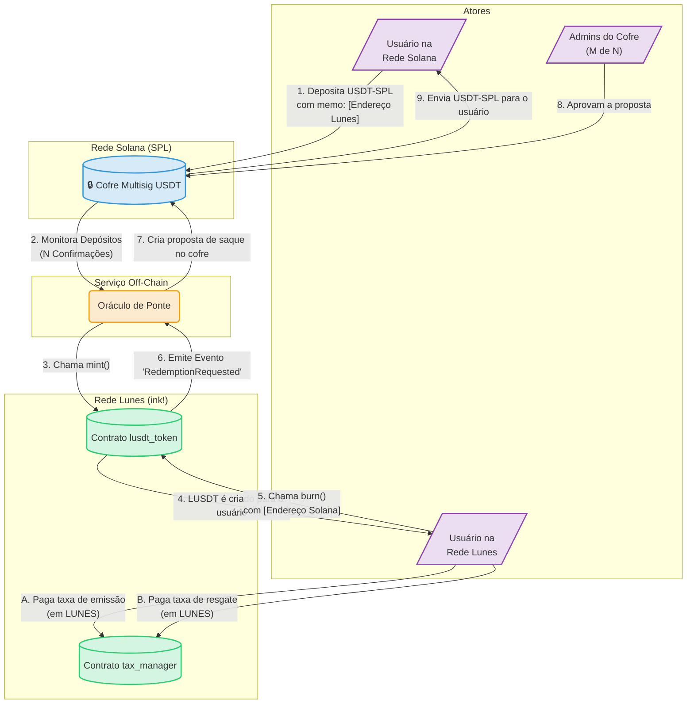

# Especificação Técnica de Backend – Projeto LUSDT

**Versão:** 1.0
**Status:** Definição
**Público-Alvo:** Desenvolvedores de Smart Contracts (Ink!), Arquitetos de Sistema, Auditores de Segurança.

---

## 1. Visão Geral da Arquitetura

O backend do LUSDT é uma solução híbrida on-chain/off-chain projetada para máxima segurança e descentralização progressiva.

- **On-chain (Rede Lunes):** Smart Contracts em **Ink! 5.1.x** que governam a lógica do token LUSDT, taxas e distribuição de fundos.
- **On-chain (Rede Solana):** Um Cofre Multisig (ex: Squads Protocol) que armazena o colateral 1:1 em USDT-SPL.
- **Off-chain (Serviço de Ponte):** Um oráculo robusto que monitora e retransmite eventos entre as redes Lunes e Solana. Este serviço é o único componente autorizado a iniciar a emissão (mint) de LUSDT.

---

## 2. Componentes On-Chain (Rede Lunes)

### 2.1. Contrato: `lusdt_token`

Implementa o token LUSDT seguindo o padrão **PSP22**.

#### 2.1.1. Estrutura de Dados (`#[ink(storage)]`)

- `psp22_data`: Estrutura padrão do PSP22 (`total_supply`, `balances`, `allowances`).
- `owner`: `AccountId` - Privilégios de administrador (deve ser um multisig). Responsável por configurar endereços críticos.
- `bridge_account`: `AccountId` - O único endereço autorizado a chamar `mint()`.
- `tax_manager_contract`: `AccountId` - Endereço do contrato de gestão de taxas.
- `paused`: `bool` - Flag para o padrão Circuit Breaker.

#### 2.1.2. Funções (Mensagens `#[ink(message)]`)

- `mint(&mut self, to: AccountId, amount: Balance)`
  - **Acesso:** Exclusivamente chamável por `bridge_account`.
  - **Segurança:** Protegido pelo modificador `when_not_paused`.
  - **Lógica:** Incrementa `total_supply` e `balances[to]`. Emite evento `Transfer`.
- `burn(&mut self, from: AccountId, amount: Balance, solana_recipient_address: String)`
  - **Acesso:** Qualquer detentor de LUSDT.
  - **Segurança:** Protegido pelo modificador `when_not_paused`. Utiliza o padrão Checks-Effects-Interactions.
  - **Lógica:**
    1.  **Checks:** Valida se `caller` tem saldo/aprovação suficiente. Valida o formato do `solana_recipient_address`.
    2.  **Effects:** Decrementa `balances[from]` e `total_supply`.
    3.  **Interactions:** Emite evento `RedemptionRequested`. Emite evento `Transfer`.
- `set_bridge_account(&mut self, new_account: AccountId)`
  - **Acesso:** Exclusivamente `owner`.
  - **Lógica:** Atualiza `bridge_account`. Emite evento `BridgeAccountUpdated`.
- `set_tax_manager_contract(&mut self, new_address: AccountId)`
  - **Acesso:** Exclusivamente `owner`.
  - **Lógica:** Atualiza `tax_manager_contract`. Emite evento `TaxManagerUpdated`.
- `toggle_pause_state(&mut self)`
  - **Acesso:** Exclusivamente `owner`.
  - **Lógica:** Altera o valor de `paused`. Emite evento `Paused` ou `Unpaused`.

#### 2.1.3. Eventos (`#[ink(event)]`)

- `RedemptionRequested { from: AccountId, solana_address: String, amount_burned: Balance }`
- Eventos de admin para rastreabilidade (ex: `BridgeAccountUpdated`, `Paused`, `Unpaused`).

---

### 2.2. Contrato: `tax_manager`

Desacopla a lógica de taxas, seguindo o princípio de responsabilidade única.

#### 2.2.1. Estrutura de Dados (`#[ink(storage)]`)

- `owner`: `AccountId` - Endereço de administrador (o mesmo do `lusdt_token`).
- `lunes_token_address`: `AccountId` - Endereço do contrato LUNES.
- `distribution_wallets`: `struct` com os endereços para `dev`, `dao`, `backing_fund`, `rewards_fund`.
- `burn_address`: `AccountId` - Endereço irrecuperável para queima.
- `fee_config`: `struct` contendo as porcentagens de taxas (em basis points) e as faixas de volume para a taxa adaptativa.
- `monthly_volume_usd`: `u128`.
- `last_volume_reset_timestamp`: `Timestamp`.

#### 2.2.2. Funções (Mensagens `#[ink(message)]`)

- `process_fees(&mut self, operation: enum, user: AccountId, fee_amount: Balance)`
  - **Acesso:** Chamada por um usuário após aprovar a transferência de LUNES.
  - **Lógica:** Baseado no tipo de operação (Mint/Burn), calcula e distribui as taxas para as carteiras corretas, incluindo bônus e queima, conforme definido em `fee_config`.
- `update_monthly_volume(&mut self, new_tx_volume_usd: u128)`
  - **Acesso:** Restrito a uma conta `keeper` autorizada (o Serviço de Ponte).
  - **Lógica:** Atualiza o volume mensal e, se necessário, zera o contador.
- `update_fee_config(&mut self, new_config: FeeConfig)`
  - **Acesso:** Exclusivamente `owner`.
  - **Lógica:** Atualiza de forma segura todos os parâmetros de taxas e carteiras.

#### 2.2.3. Consultas (`#[ink(message)]`)

- `get_current_fee_bps(&self)`
  - **Lógica:** Retorna a taxa base atual com base no volume mensal.

---

## 3. Componente Off-Chain (Serviço de Ponte)

Componente crítico que exige robustez, segurança e monitoramento.

### 3.1. Módulo de Monitoramento de Depósitos (Solana -> Lunes)

- **Tecnologia:** RPC da Solana via WebSockets (`accountSubscribe` ou `logsSubscribe`).
- **Fluxo:**
  1.  O serviço monitora transações de USDT-SPL para o endereço do cofre.
  2.  **Validação:** Ao receber uma transação, verifica o ativo, o valor e o `memo` (que deve conter o AccountId Lunes do usuário).
  3.  **Confirmação:** Aguarda N confirmações no nível `finalized` para mitigar reorgs.
  4.  **Estado:** Registra a transação em um DB interno (ex: PostgreSQL) com status `PENDING_MINT` para garantir idempotência.
  5.  **Disparo:** Invoca `mint()` no contrato `lusdt_token` na rede Lunes.
  6.  **Atualização:** Atualiza o status no DB para `COMPLETED` após a finalização do mint.

### 3.2. Módulo de Processamento de Resgates (Lunes -> Solana)

- **Tecnologia:** Indexador (ex: Subsquid) ou cliente Lunes para escutar o evento `RedemptionRequested`.
- **Fluxo:**
  1.  O serviço detecta um novo evento `RedemptionRequested`.
  2.  **Criação da Proposta:** Cria uma proposta de transação no cofre multisig da Solana.
  3.  **Estado:** Registra o pedido no DB com status `AWAITING_MULTISIG_APPROVAL`.
  4.  **Alerta:** Notifica os administradores do multisig sobre a transação pendente.
  5.  **Monitoramento:** Monitora a execução da transação na Solana e atualiza o DB para `COMPLETED`.

---

## 4. Componente On-Chain (Cofre Multisig - Solana)

- **Política de Segurança:** Mínimo de **3 de 5** assinaturas.
- **Signatários:** Membros-chave da equipe, distribuídos geograficamente, usando exclusivamente carteiras de hardware.
- **Processo de Aprovação:** Verificação manual de cada transação contra uma fonte de verdade (painel do Serviço de Ponte) antes de assinar.

---

## 5. Regras de Negócio Essenciais (Sumário)

- **RN01 (Paridade):** `LUSDT.total_supply()` NUNCA deve exceder o balanço de USDT no cofre Solana.
- **RN02 (Taxa de Emissão):** Inicialmente 0.5% (adaptativa), paga em LUNES.
  - Distribuição: 40% (Desenvolvimento), 25% (Fundo de Lastro), 20% (DAO), 15% (Recompensas).
- **RN03 (Taxa de Resgate):** Inicialmente 0.5% (adaptativa), paga em LUNES.
  - Distribuição: 40% (Desenvolvimento), 20% (Queima), 20% (DAO), 20% (Bônus ao usuário).
- **RN04 (Taxa Adaptativa):** As taxas se ajustam com base no volume de 30 dias:
  - Até $10k: 0.6%
  - $10k - $100k: 0.5%
  - Acima de $100k: 0.3%

---

## 6. Fluxograma da Arquitetura

O diagrama a seguir ilustra o fluxo de dados e as interações entre os componentes do sistema LUSDT.

---

Lunes Network Endpoints

- **Testnet:**
  - `wss://ws-test.lunes.io`
- **Mainnet:**
  - `wss://ws.lunes.io
  - `wss://ws-lunes-main-01.lunes.io`
  - `wss://ws-lunes-main-02.lunes.io`
  - `wss://ws-archive.lunes.io`

For development and testing, use the testnet (`wss://ws-test.lunes.io`). For real operations, choose one of the mainnet endpoints, such as `wss://ws.lunes.io

---
TETHER REDE SOLANA
Es9vMFrzaCERmJfrF4H2FYD4KCoNkY11McCe8BenwNYB